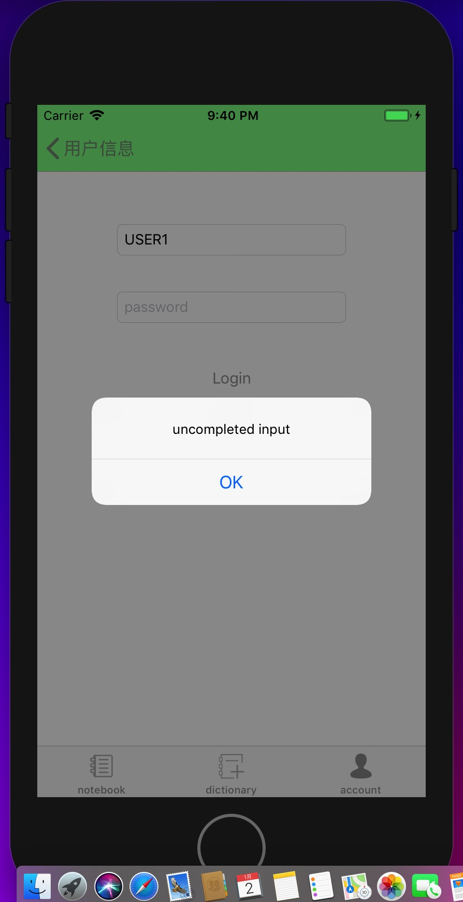
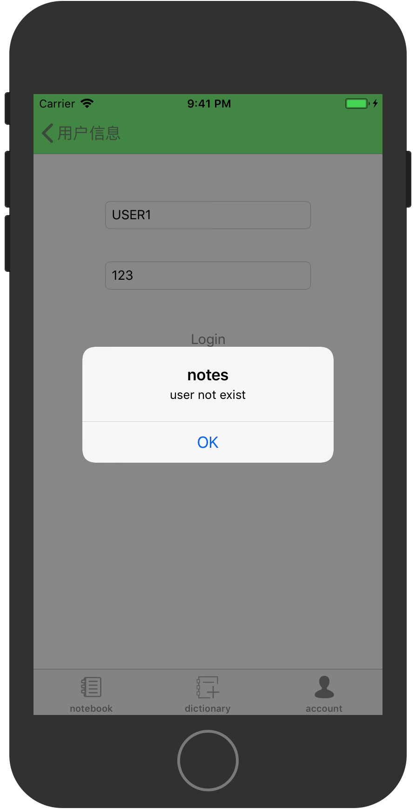
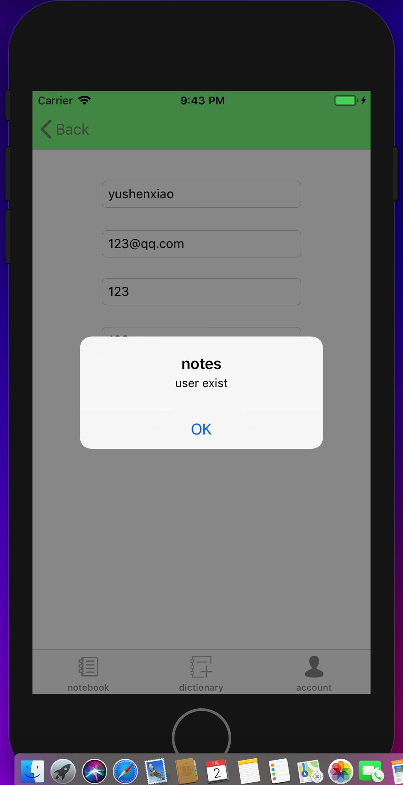
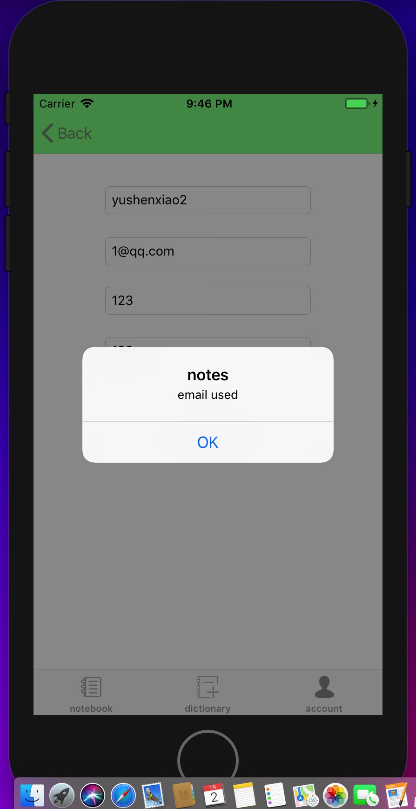
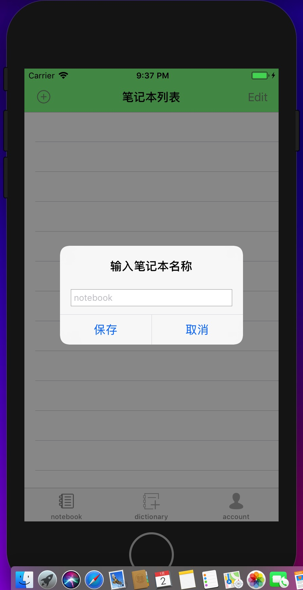

ELEPHANTNOTE
==

概述
--
elephantnote是一款笔记应用

*支持多个笔记本分别记录

*支持图片的插入

*支持表情的插入

*支持拍照并插入

*支持录音功能

*支持笔记的手写，以图片形式保存

*支持添加闹钟提醒

*支持用户的注册和登录，后台数据库存储用户信息

*定义生词本，可以任意添加文本至生词本

**151220035 郭雨琦 151220155 俞沈啸**

界面
--

应用主界面显示所有的笔记本

存储用户的生词

后台说明
--
后台利用mongod数据库记录已注册的用户信息并根据GET和POST方法作出回应，利用express框架定义了user模型并通过注册、登录界面实现交互，定义了login.js和reg.js分别对用户逻辑作出响应

其他
--
可以在笔记内将文本添加到生词本
可以保存多张图片

不足
--
存储的效率不高，界面比较简洁，不够丰满
